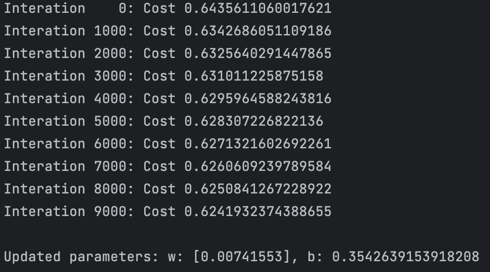
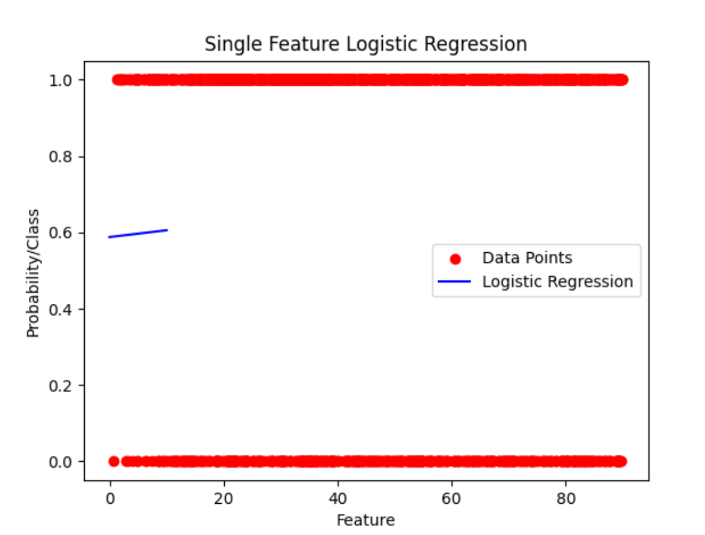
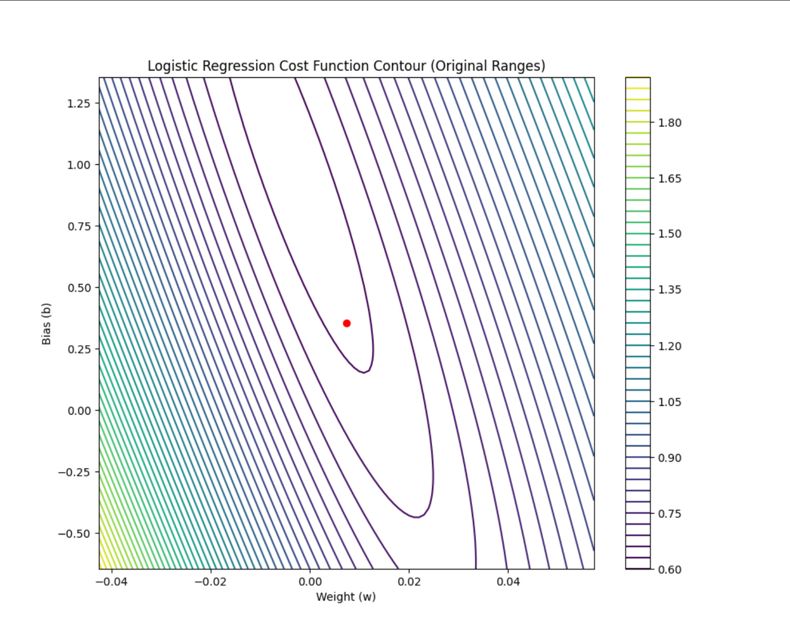

# Trading Algorithm using Machine Learning
## Introduction
This project aims to optimize a trading algorithm leveraging machine learning techniques. The primary goal is to automate the process and enhance performance without the need for constant manual intervention. The initial model employed is based on logistic regression.
## Implementation Details

### Logistic Regression Model
Instead of using pre-built libraries like sklearn.linear_model.LogisticRegression, this project involves building the logistic regression model from scratch. This approach aids in understanding the fundamental mechanisms and allows for future expansions. The model is built around two key components:
- Cost Function: The core of the logistic regression model.
- Gradient Descent: An optimization algorithm used to refine the Cost Function.

#### Cost Function: Measure of losses over a training set
$$J(\vec{w},b)=\frac{1}{m}\sum_{i=1}^{m}(\mathrm{f}\vec{w},b(\vec{x}^{i}),y^{i})$$

#### Lost function(function inside the cost function): Measue of differnce of a single example to its target value 

$$
L(\mathrm{f}\vec{w},b(\vec{x}^{i}),y^{i}) = 
\begin{cases}
    -y^i*log(\mathrm{f}\vec{w},b(\vec{x}^{i}) & \text{if } y^i = 1, \\
    -(1-y^i)log(1-\mathrm{f}\vec{w},b(\vec{x}^{i}) & \text{if } y^i = 0.
\end{cases}
$$

#### Gradient Descent: Algorithm used to optimize the cost function and find best value for w and b, where a is learning rate.
$$w_j = w_j - a[\frac{1}{m}\sum_{i=1}^{m}(\mathrm{f}\vec{w},b(\vec{x}^{i})-y^i)x_j^i]$$

$$b = b - a[\frac{1}{m}\sum_{i=1}^{m}(\mathrm{f}\vec{w},b(\vec{x}^i)-y^i)]$$

### Regularization
To prevent overfitting or underfitting, regularization is applied. It involves reducing feature sizes.
#### Regularization Cost Function: This is just the cost function with one additional element

$$
J_{reg}(\vec{w},b) = J(\vec{w},b) + \frac{\lambda}{2m}\sum_{i=1}^{m}w_j^2 = 
\begin{cases}
    \text{if } \lambda=0 & \text{overfit}, \\
    \text{if } \lambda=\lambda \to \infty & \text{underfit}
\end{cases}
$$

#### Regularization Gradient Descent: This is just the gradient descent algorithm with one additional element
- Formula for w changes while the formula for b stays the same.

$$w_j = w_j - a[\frac{1}{m}\sum_{i=1}^{m}(\mathrm{f}\vec{w},b(\vec{x}^{i})-y^i)x_j^i] + \frac{\lambda}{m}w_j$$

$$b = b - a[\frac{1}{m}\sum_{i=1}^{m}(\mathrm{f}\vec{w},b(\vec{x}^i)-y^i)]$$

## Angle Data for the Model
The model uses angles as input data to predict probabilities.

### Calculating Slope
To determine the slope at a point of interest:
$$m = \frac{y_{2} - y_{1}}{x_{2} - x_{1}}$$

### Calculating Angle of Intersection
Once the slope is obtained, the angle of intersection is calculated using:
$$\theta = arctan(|\frac{m_{1} - m_{2}}{1 + m_{1}m_{2}}|)$$

$$\theta \text{ in degrees} = \theta * \frac{180}{\pi}$$

## Results and Analysis

### Analysis of Angle Data
Upon thorough analysis of the angle data within our dataset, it is observed that there is a negligible correlation between the angle values and the win/loss rate. This finding aligns with initial expectations, given the model's reliance on a single feature, which typically offers limited predictive power.

### Interpretation
The lack of significant correlation in this context is not surprising. Single-feature models often struggle to capture the complexities inherent in datasets where outcomes (like win/loss rates) are influenced by multiple factors. Therefore, the current analysis reinforces the hypothesis that a more robust model, integrating additional relevant features, is necessary for more accurate predictions.

    
     
    <em>Gradient Descent in action</em>

 

    
     
    <em>Sigmoid function being plotted, 0's are losses 1's are wins</em>

 

    
     
    <em>Cost Function optimization</em>

### Future Directions
#### Expanding the Feature Set

The next phase of my research will focus on identifying and incorporating additional features that are potentially correlated with the win/loss outcomes. This includes but is not limited to:

- **Rate of increase**:This feature measures the rate at which a certain variable (e.g., price, volume, etc.) increases over a specified time frame. In the context of win/loss outcomes, this rate could provide insights into momentum trends, potentially indicating periods of heightened activity or interest. For instance, a rapid rate of increase might correlate with higher win rates due to market enthusiasm, while a slower rate could suggest caution or uncertainty among participants.
- **Time Passed Since Last Trade (or Number of Bars Since Last Trade)**: This feature captures the duration since the last trading activity, which can be a critical indicator of market sentiment and trader behavior. In terms of its relevance, this duration might reflect the market’s response time or the latency in reaction to external events. Shorter intervals could imply a more active and responsive market, potentially leading to higher win rates, while longer intervals might indicate a less dynamic market environment, possibly correlating with lower win rates.
#### Model Enhancement

Further, I plan to refine our predictive model by:

- Integrating these new features and analyzing their collective impact.
- Exploring more complex modeling techniques that can capture the multi-dimensional nature of the data.

### Conclusion
This initial phase of analysis sets the groundwork for a more comprehensive study. By expanding our feature set and employing advanced modeling strategies, I aim to significantly improve the accuracy of our predictions and gain deeper insights into the factors influencing win/loss rates.
